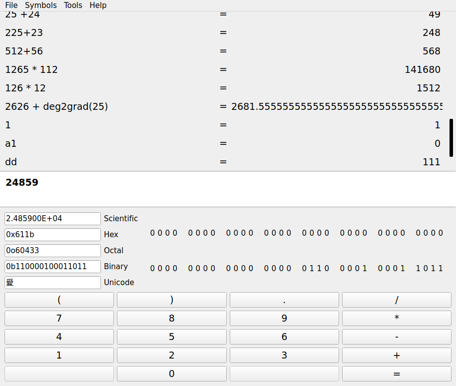

 

# qCalculator
This project aims to provide an accurate, extensible and fast calculator application.

## Features
- 100+ built in arithmetic operations
- Up to 2'147'483'647 decimal digits of precision
- Warning for inexact results
- Symbol table editor
- Python Addons

## Downloads
Release binaries for 64bit Windows and Linux can be found on the [Releases](https://github.com/vetux/qcalculator/releases) page.

## How to install Addons
1. Download the qcalculator_addons.tar addon bundle from the [Releases](https://github.com/vetux/qcalculator/releases) section of this repository.
2. Click the install button in the "Addons" tab of the settings dialog and select the downloaded file.
3. Select the addons you wish to install from the bundle and hit "Install Selected".

# Screenshots

# Known Issues
- Writing archive files ("Create Addon Bundle" or "Compress...") on Windows causes the resulting file to be a corrupted archive because the windows build of libarchive is full of bugs. (libarchive dependency will be removed in the future to resolve this issue)

## Developing Addons
Addons are python files containing load and unload methods that are called when the user enables the
addon in the user interface.

To be able to install the addon through the user interface the addon must be packaged into an addon bundle.

Addon bundles can be created by selecting the "Create Addon Bundle" option in the "Tools" menu or by creating an archive file compatible with libarchive containing the addon_bundle.json and modules / package files.

Examples of using PySide2 to modify the interface and using exprtk to modify the symbol table aswell as the default addons can be found in [python/addon](python/addon/).

The [python/lib]("python/lib") directory contains the qcalculator packages for interfacing with the native window and symbol table.

# Building
For information on how to build the application see: [BUILDING.md](BUILDING.md)

